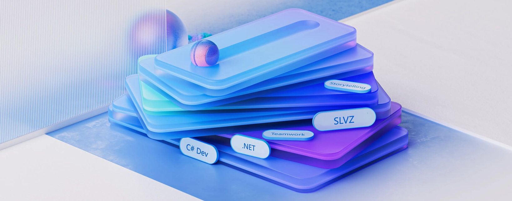

# Hi, I'm Ashkan Selahvarzi 👋

### Solo .NET Developer

---

I build complete apps on my own — from idea to architecture to a published product. Since **2014** I've worked in the .NET ecosystem, mainly with **C#** and **.NET MAUI Blazor Hybrid**, shipping apps that have reached **20,000+ users** across Windows, Android, and the Web.

No team, no handoffs — just me designing, coding, and releasing.

---

### What I Build

- 📱 **Mobile** — .NET MAUI Blazor Hybrid apps for Android

- 🖥️ **Desktop** — .NET MAUI apps for Windows

- 🌐 **Web** — ASP.NET & Blazor apps and APIs

**Some of my projects:** OneApi · LangCraft · Hoghoogh Yar · Notepad

---

### Connect

